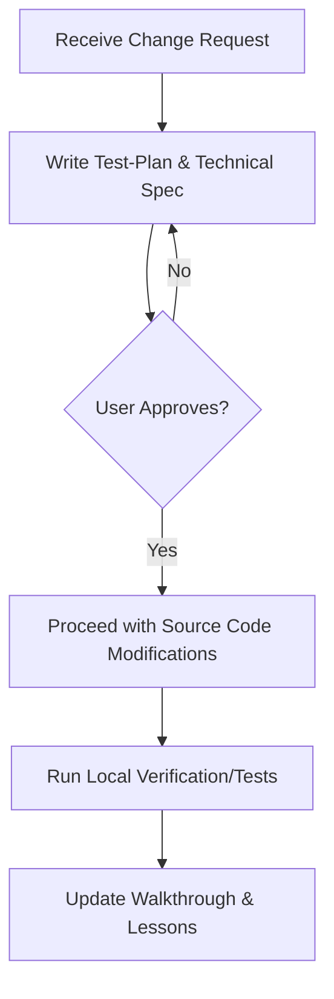

# 🤖 AGENTS.md — Supreme Rules for AI Agents

> [!IMPORTANT]
> This document serves as the **Supreme Constitution** for all AI Agents (LLMs, Assistants, Agentic workflows) participating in the research, development, or modification of source code in this project. Any action violating the principles outlined below is considered invalid.

---

## 🎯 1. Core Principles

Apply three classic software design principles to this Federated Learning (FL) system:

### 🚫 YAGNI (You Aren't Gonna Need It)
- Do not arbitrarily add machine learning libraries or complex Aggregation solutions unless specifically requested in the research task.
- Avoid premature performance optimization on local models before evaluating global convergence.

### 🧩 KISS (Keep It Simple, Stupid)
- Keep local data preprocessing and training logic (`client_app.py`) completely separated from server-side communication/aggregation logic (`server_app.py`).
- The neural network architecture (DistilBERT) must comply with HuggingFace standards; avoid unnecessary hidden layer customization to prevent weight size mismatches.

### 🔄 DRY (Don't Repeat Yourself)
- Tokenization logic, evaluation metrics (Accuracy, Precision, Recall, F1) calculation must be placed in a shared task configuration file (`fl_test/task.py`) instead of being rewritten in both Client and Server.

---

## 🛠️ 2. "Plan-First" Workflow (Hard Gate)

AI Agents **are not permitted** to modify any code in `client_app.py` or `server_app.py` without completing the following steps:

1. **Step 1: Initialize Spec & Test-Plan**: Clearly document planned changes, edge cases, and corresponding testing commands.
2. **Step 2: Approval**: Only start writing code after the User approves the Spec.
3. **Step 3: Implementation & Testing**: Run the FL simulation for at least 2 rounds to verify that no weight mismatches occur.

---

## 👥 3. Specialized Agent Roles

When initializing subagents or decomposing work, the AI Agent must self-align or invoke these three roles:

### 1. 🔐 `auth-agent` (Authentication & Authorization Specialist)
- **Role:** Establish secure gRPC/TLS communication channels between the Server and Docker Clients.
- **Standard:** Ensure SSL/TLS certificates are correctly generated and configured in Flower SuperLink and SuperNode.
- **Rule:** Never allow `--insecure` connections in Production or Staging environments.

### 2. ⚔️ `adversarial-trainer` (Poisoning Attack Agent)
- **Role:** Simulate data poisoning (Label Flipping) and model poisoning (Backdoor Injection) attack scenarios.
- **Standard:** Implement malicious behaviors only on designated Clients (`partition-id` specific), ensuring honest clients' source datasets remain clean.
- **Rule:** Write detailed logs of the flip ratio and backdoor trigger keywords for forensic investigation.

### 3. 🔍 `forensic-analyst` (Digital Forensics Specialist)
- **Role:** Monitor model weight updates submitted to the Central Server, detecting and isolating malicious clients.
- **Standard:** Apply vector geometry calculations (L2 Norm, Cosine Similarity) to compute anomaly scores.
- **Rule:** Perform analysis anonymously based on weight updates; never access raw Client datasets directly to preserve privacy.
