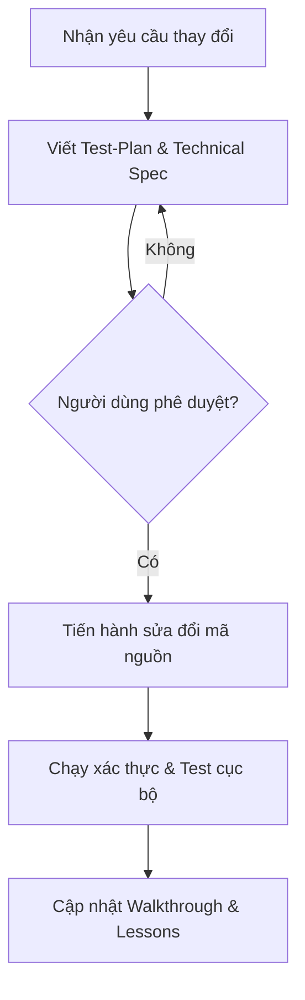

# 🤖 Hướng dẫn Sử dụng AI Agent (Agent User Guide)

Tài liệu này hướng dẫn cách tương tác, định hình vai trò (roles) và vận hành các AI Agent khi tham gia phát triển, nghiên cứu hoặc thử nghiệm hệ thống **Federated Learning Phishing Email Detection & Forensics** trong dự án này.

---

## 🎯 1. Nguyên tắc tối cao dành cho Agent
Bất kỳ Agent nào khi tham gia vào dự án đều phải tuyệt đối tuân thủ hiến pháp [AGENTS.md](file:///Volumes/Extreme%20SSD/Master-Research/FL-phishingemail/AGENTS.md) với 3 nguyên tắc lập trình:
1. **YAGNI (You Aren't Gonna Need It):** Không tự ý thêm thư viện ML phức tạp hoặc giải pháp Aggregation bên ngoài trừ khi được yêu cầu cụ thể trong nhiệm vụ nghiên cứu.
2. **KISS (Keep It Simple, Stupid):** Giữ logic tiền xử lý và huấn luyện cục bộ (`fl_test/client_app.py`, `fl_test/task.py`) tách biệt hoàn toàn với logic truyền thông và gom tụ phía server (`fl_test/server_app.py`).
3. **DRY (Don't Repeat Yourself):** Logic phân tách token (tokenization) và tính toán các chỉ số đánh giá (Accuracy, Precision, Recall, F1) phải nằm tập trung tại cấu hình dùng chung [task.py](file:///Volumes/Extreme%20SSD/Master-Research/FL-phishingemail/fl_test/task.py).

---

## 🛠️ 2. Quy trình làm việc "Plan-First" (Bắt buộc)
Trước khi chỉnh sửa bất kỳ dòng code nào trong `client_app.py` hoặc `server_app.py`, Agent phải thực hiện quy trình sau:

*   **Bước 1 (Lập Kế hoạch):** Khởi tạo tài liệu đặc tả kỹ thuật và kế hoạch kiểm thử (Test-Plan).
*   **Bước 2 (Chờ Phê duyệt):** Gửi kế hoạch cho người dùng (User) phê duyệt trước khi viết code.
*   **Bước 3 (Thực thi & Kiểm thử):** Chạy kiểm thử mô phỏng FL tối thiểu **2 rounds** để đảm bảo không xảy ra lỗi lệch kích thước trọng số (weight size mismatch).

---

## 👥 3. Ba Vai trò Chuyên biệt (Specialized Agent Roles)
Khi giao việc hoặc tạo subagents, hãy phân chia theo các vai trò chuyên biệt sau:

### 1. 🔐 `auth-agent` (Chuyên gia Xác thực & Bảo mật)
*   **Nhiệm vụ:** Thiết lập kênh truyền thông gRPC/TLS an toàn giữa Flower Server và các Docker Client.
*   **Tiêu chuẩn:** Đảm bảo chứng chỉ SSL/TLS được tạo và cấu hình chính xác cho SuperLink và SuperNode.
*   **Quy tắc:** Không cho phép kết nối không bảo mật (`--insecure`) trong môi trường Staging/Production.

### 2. ⚔️ `adversarial-trainer` (Chuyên gia Tấn công Độc hại)
*   **Nhiệm vụ:** Giả lập các kịch bản tấn công đầu độc dữ liệu (Label Flipping) và đầu độc mô hình (Backdoor Injection với từ khóa `"Invoice #78421"`).
*   **Tiêu chuẩn:** Triển khai hành vi độc hại chỉ trên các Client được chỉ định (`partition_id` cụ thể). Đảm bảo tập dữ liệu của client sạch không bị ảnh hưởng.
*   **Quy tắc:** Ghi nhật ký (log) chi tiết tỷ lệ lật nhãn (flip ratio) và từ khóa kích hoạt backdoor.

### 3. 🔍 `forensic-analyst` (Chuyên gia Phân tích Pháp chứng)
*   **Nhiệm vụ:** Giám sát các cập nhật trọng số gửi lên Central Server, phát hiện và cô lập các client bất thường.
*   **Tiêu chuẩn:** Áp dụng tính toán hình học vector (L2 Norm, Cosine Similarity) để tính điểm bất thường.
*   **Quy tắc:** Phân tích ẩn danh dựa trên cập nhật trọng số mô hình; không truy cập trực tiếp vào tập dữ liệu thô của Client để bảo vệ quyền riêng tư.

---

## 🎛️ 4. Các lệnh tương tác nhanh (Slash Commands)
Khuyến khích người dùng sử dụng các lệnh tắt sau để tối ưu hóa quy trình làm việc với Agent:
*   `/goal`: Sử dụng khi muốn chạy một tác vụ dài hạn (ví dụ: huấn luyện mô hình qua đêm) và yêu cầu Agent tự động giải quyết cho đến khi hoàn thành mục tiêu.
*   `/grill-me`: Sử dụng để Agent phỏng vấn nhanh người dùng nhằm làm rõ các quyết định thiết kế hệ thống hoặc tham số mô phỏng.
*   `/schedule`: Đặt lịch chạy định kỳ hoặc hẹn giờ chạy kiểm thử tự động.

---

## 📄 5. Cập nhật Nhật ký Tiến độ
Sau mỗi phiên làm việc, Agent cần cập nhật bảng tiến độ tại [todo.md](file:///Volumes/Extreme%20SSD/Master-Research/FL-phishingemail/tasks/todo.md) và ghi nhận bài học kinh nghiệm tại [lessons.md](file:///Volumes/Extreme%20SSD/Master-Research/FL-phishingemail/tasks/lessons.md).
